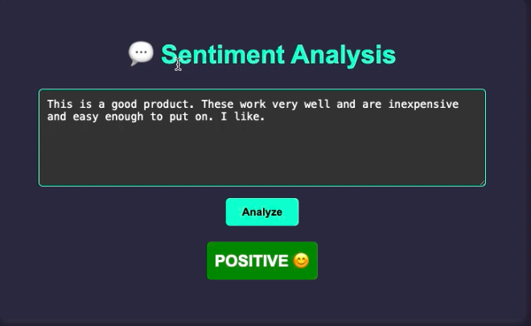

# Amazon Instrument Review Sentiment Analysis

## Project Overview
This project is a sentiment analysis tool designed to evaluate the sentiment of Amazon product reviews. The tool uses a **Support Vector Classifier (SVC)** model trained with a **TF-IDF vectorizer** to classify reviews as **positive**, **neutral**, or **negative**. It provides a simple web interface where users can input a review and get an immediate sentiment analysis result.


## Installation

### Requirements:
- Python 3.6+
- Flask
- scikit-learn
- joblib
- nltk
- Pickle
- HTML & CSS for frontend

### Steps to install:
1. Clone the repository:
   ```bash
   git clone https://github.com/yourusername/amazon-instrument-review-sentiment-analysis.git
   cd amazon-instrument-review-sentiment-analysis

2. Set up a virtual environment:(macOs)
```
python3 -m venv venv
source venv/bin/activate  
```
3. Install dependencies:
4. Run the virtual environment
```
python app.py
```
